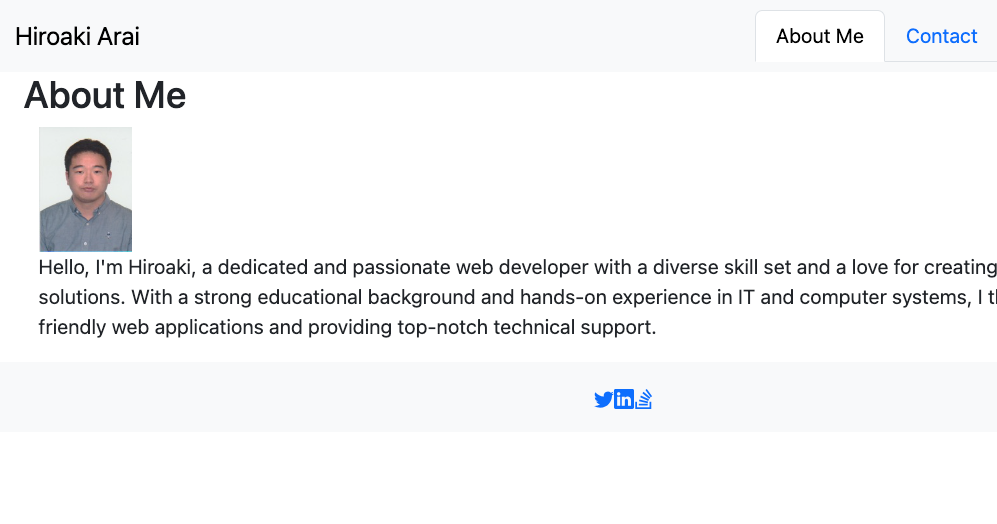

# react-portfolio

## Description

My Portfolio Website is a personal portfolio showcasing my projects and skills. It provides information about me, my projects, and how to contact me. I want potential employer to view a my deployed React portfolio of work samples.

## Live Link

A live link of the portfolio can be accessed at [https://hiroro1989.github.io/react-portfolio/]

## Technologies Used

- React.js
- Bootstrap (or any other CSS framework)
- HTML5
- CSS3
- JavaScript
